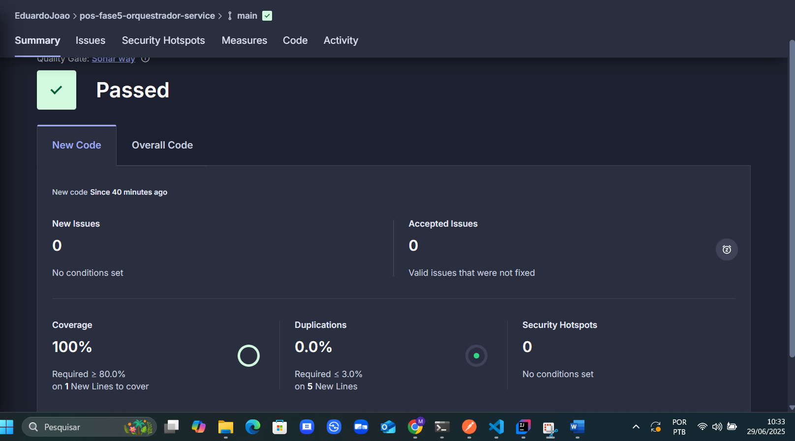

# FIAP X - Processador de Vídeos (Orquestrador)

Este serviço é responsável pelo orquestramento do processamento de vídeos, oferecendo endpoints para upload, status e download de vídeos com extração de frames.

## Responsabilidades

- **Upload de Vídeos**: Recebe arquivos de vídeo via multipart/form-data
- **Processamento Assíncrono**: Coordena o processamento de vídeos para extração de frames
- **Gerenciamento de Status**: Monitora e controla o status dos processamentos
- **Download de Resultados**: Disponibiliza os frames processados em formato ZIP
- **Integração com AWS**: Utiliza S3 para armazenamento e SQS para filas de processamento

## Endpoints Disponíveis

### Upload

| Método | Endpoint | Descrição | Autenticação |
|--------|----------|-----------|--------------|
| POST | `/upload` | Faz upload de um vídeo e inicia processamento | Sim |

### Download

| Método | Endpoint | Descrição | Autenticação |
|--------|----------|-----------|--------------|
| POST | `/download/process-and-download` | Upload, processa e retorna ZIP com frames | Sim |
| POST | `/download/{id}` | Baixa arquivo ZIP dos frames processados | Sim |

### Status

| Método | Endpoint | Descrição | Autenticação |
|--------|----------|-----------|--------------|
| GET | `/status` | Lista todos os arquivos ZIP gerados | Sim |

## Modelos de Dados

### Resposta de Status
```json
{
  "total": 3,
  "files": [
    {
      "id": "1111",
      "filename": "frames_20250613_093000.zip",
      "size": "2.5MB",
      "created_at": "2025-06-13T09:30:00Z",
      "status": "COMPLETED",
      "download_url": "/download/frames_20250613_093000.zip"
    }
  ]
}
```

### Informações do Arquivo
```json
{
  "id": "1111",
  "filename": "frames_20250613_093000.zip",
  "size": "2.5MB",
  "created_at": "2025-06-13T09:30:00Z",
  "status": "COMPLETED",
  "download_url": "/download/frames_20250613_093000.zip"
}
```
## Arquitetura

### Componentes do Sistema

- **Orquestrador** (este serviço): Coordena o fluxo de processamento
- **Core API**: Serviço responsável pelo processamento efetivo dos vídeos
- **Amazon S3**: Armazenamento de vídeos originais e processados
- **Amazon SQS**: Fila para processamento assíncrono
- **Amazon Cognito**: Autenticação e autorização

### Fluxo de Processamento

1. Cliente faz upload do vídeo via `/upload`
2. Vídeo é armazenado no S3 bucket de uploads
3. Mensagem é enviada para a fila SQS
4. processor processa o vídeo e extrai frames
5. Frames são compactados em ZIP e armazenados no S3 de downloads
6. Cliente pode verificar status via `/status`
7. Cliente faz download do ZIP via `/download/{id}`

## Como Executar

```bash
# Build
mvn clean package

# Cobertura de teste
mvn verify
```

## Deploy no Kubernetes

O projeto inclui configurações para deploy no AWS EKS:

- Branch infra-kubernets tem uma esteira de deploy configurando todo o cluster.
- Branch main ou develop existe duas pastas que vem ser executadas via terraform a infra-db deve ser inputado no arquivo terraform.tfvars os outputs da infra-kubernets e a ProtheusGrafana.

- Pasta k8s tem as configs do serviço deployment, service e ingress a esteira está preparada para fazer o deploy.
- `k8s/deployment.yaml`: Configuração do deployment e service
- `k8s/ingress.yaml`: Configuração do ingress para roteamento

```bash
# Deploy da aplicação
kubectl apply -f k8s/

# Deploy do monitoramento (Prometheus + Grafana)
cd PrometheusGrafana
terraform init
terraform apply
```

## Evidência de cobertura de teste
